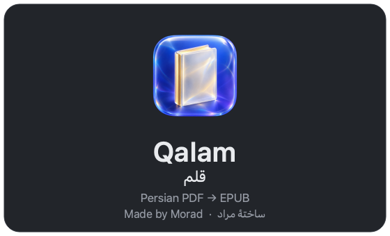
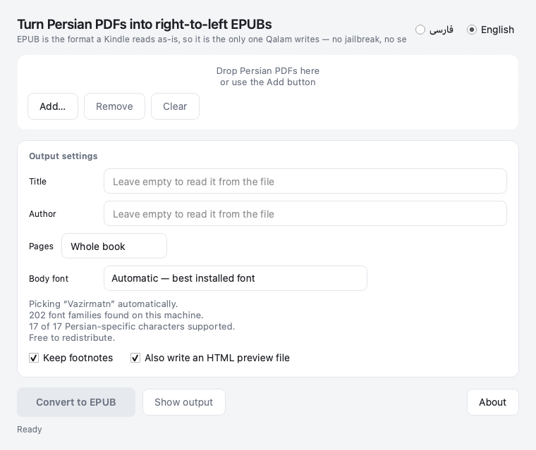

<p align="center">
  
</p>

# Qalam — قلم

A Persian PDF to EPUB converter. Drop in a PDF, get a right-to-left EPUB that a
Kindle, an iPad, or a Kobo opens without further work.



## Why EPUB is the only output

A Kindle reads EPUB directly: Amazon's Send to Kindle service converts it
server-side. It will not take MOBI or KFX unless the device has been jailbroken,
and both of those are dead formats anyway. So Qalam writes EPUB 3 and nothing
else. Writing a second format would only add a step between you and the book.

## Requirements

**macOS.** This is not a packaging accident. Text extraction runs on Apple's
PDFKit, and that choice is load-bearing (see below). There is no Linux or
Windows build and no plan for one.

- macOS 12 or later
- Python 3.11 or later

## Install

```bash
git clone https://github.com/aghamorad/qalam.git
cd qalam
python3 -m venv .venv
.venv/bin/pip install -e .
```

Run the app:

```bash
.venv/bin/qalam-gui
```

Or from the command line:

```bash
.venv/bin/qalam book.pdf -o book.epub
```

## Using it

The window has one job. Add PDFs, set a title and author if the file doesn't
carry them, choose a body font (or leave it on Automatic), and press Convert.
The interface switches between English and Persian with the radio buttons in the
header and remembers which one you picked.

Everyday options:

| | |
|---|---|
| **Pages** | Convert the whole book, or the first N pages while you check the settings. |
| **Body font** | Any Persian family installed on this machine, plus the bundled Vazirmatn. |
| **Keep footnotes** | Turn numbered notes into linked endnotes instead of dropping them. |
| **Also write an HTML preview** | A single file you can open in a browser and read before committing to the EPUB. |

The command line takes the same options:

```bash
.venv/bin/qalam --help
.venv/bin/qalam --list-fonts          # every Persian family found, ranked
.venv/bin/qalam book.pdf --pages 20 --preview
```

## How it works

The conversion is four steps, and each one exists because of a specific thing
that goes wrong otherwise.

**1. Extract.** PDFKit reads the page and reports what is actually printed:
each span of text with its font size, family, style flags, and bounding box.
This is the step that makes the app macOS-only. PyMuPDF and poppler both
re-order Arabic-script text on their own and get it wrong: a lam-alef ligature
comes back transposed, so `تلاش` arrives as `تالش`; digit runs inside a
right-to-left line come out in visual order; parentheses end up mis-paired. The
PDF is fine (its `ToUnicode` map has the ligature down correctly), so there is
nothing to repair in the file, only a broken extractor to route around. PDFKit
returns logical order, correct digits, and correct parentheses on the same page.

**2. Normalize.** Extraction produces text that is nominally Persian and wrong
in specific, recurring ways: Arabic presentation forms instead of base letters,
Arabic yeh and kaf where Persian wants U+06CC and U+06A9, stray bidi control
characters, non-breaking spaces wedged into the middle of words. These are fixed
in a fixed order, because the order matters. Presentation forms have to be
decomposed before codepoints are mapped, and bidi controls have to be gone
before anything reasons about where a word ends.

**3. Structure.** Lines become blocks: headings, paragraphs, poetry, footnotes.
The signals are deliberately few, because every Persian PDF is laid out a little
differently and a clever rule that reads one book correctly will wreck another.
Font size is the load-bearing signal: a page's sizes cluster hard, and each
cluster above body size is a heading level. Weight is not reliable (these
legacy Persian fonts set the bold flag on ordinary body text), so it only breaks
ties. Centering, vertical gaps, and right-edge indentation carry the rest. In a
right-to-left book the paragraph's start edge is its *right* edge, which is the
single easiest thing to get backwards.

**4. Render and package.** Blocks become XHTML and CSS, and the result is zipped
into an EPUB 3 by hand rather than through a library. That is deliberate:
`page-progression-direction="rtl"` has to land on the OPF spine, because the
spine is what makes a reader open the book on the right-hand page and turn
leftward. Without it the book still reads correctly and still turns pages the
Western way, which is the most common failure in Persian EPUBs and is invisible
until someone tries to read one. The archive is written to spec: `mimetype`
first, stored uncompressed, no extra field.

A Persian font is embedded in the file. E-readers do not ship a Persian face
worth relying on, and the fonts these PDFs were typeset in are commercial
Iranian designs that your reader certainly does not have.

## Fonts and licensing

Qalam bundles **Vazirmatn** by Saber Rastikerdar, under the SIL Open Font
License 1.1, so that a converted book carries a Persian face even on a machine
with none installed.

It also finds every Persian-capable family already on your Mac (measured from
each font's own character map, not a hardcoded list) and offers them in the font
menu. Families it knows to be open-licensed are marked; anything else is
labelled `[personal use]`, because embedding a commercial Iranian font inside a
book you give away is your call to make, not something to do silently. IRANSans
is in that second group: the FontIran licence does not permit redistributing the
files.

## Development

```bash
.venv/bin/python tests/test_normalize.py
QT_QPA_PLATFORM=offscreen .venv/bin/python tests/test_gui_smoke.py sample.pdf
```

Both are plain scripts that print a line per check and exit non-zero on failure;
neither needs a test runner.

`test_gui_smoke.py` drives the real window through a real conversion on the
offscreen Qt platform, which catches the failures a pipeline test cannot see: a
signal wired to the wrong slot, a worker thread that never reports progress. It
caps itself at six pages, so point it at a real book.

The icon is generated, not drawn by hand:

```bash
.venv/bin/python tools/make_icon.py            # from data/icon-source.png
.venv/bin/python tools/make_icon.py --draw     # a geometric fallback, no artwork needed
```

It converts the artwork's flat backdrop to real transparency with a border flood
fill, keeps only the largest connected component so floating specks disappear,
seals pockets enclosed by the tile so the dark crevices inside the book stay
opaque, erodes the mask by one pixel to stop a dark rim appearing on a light
background, and refits the tile to Apple's 824-of-1024 icon grid. Then `sips`
and `iconutil` build the `.icns`.

`tools/` also holds the probe scripts used to work out the extraction and
structuring behaviour against real books. They are kept because they document
what was measured, not because they are part of the app.

## Credits

Written by **Morad**.

## License

MIT, for the code. Vazirmatn is under the SIL Open Font License 1.1 and that
license governs `persian_ebook/data/fonts/`. See [LICENSE](LICENSE).
